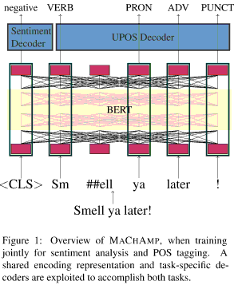

# MaChAmp: Massive Choice, Ample Tasks

[](LICENSE)

[]()

> One arm alone can move mountains.


This code base is an extension of the
[AllenNLP](https://github.com/allenai/allennlp) library with a focus on
multi-task learning. It has support for training on multiple datasets for a
variety of standard NLP tasks. For more information we refer to the paper:
[Massive Choice, Ample Tasks (MACHAMP): A Toolkit for Multi-task Learning in
NLP](https://arxiv.org/pdf/2005.14672.pdf)

[]()

## Installation

To install all necessary packages run:

```
pip3 install --user -r requirements.txt
```

## Training

To train the model, you need to write a configuration file. Below we show an
example of such a file for training a model for the English Web Treebank in
the Universal Dependencies format.

```
{
    "UD-EWT": {
        "train_data_path": "data/ewt.train",
        "dev_data_path": "data/ewt.dev",
        "word_idx": 1,
        "tasks": {
            "lemma": {
                "task_type": "string2string",
                "column_idx": 2
            },
            "upos": {
                "task_type": "seq",
                "column_idx": 3
            },
            "xpos": {
                "task_type": "seq",
                "column_idx": 4
            },
            "morph": {
                "task_type": "seq",
                "column_idx": 5
            },
            "dependency": {
                "task_type": "dependency",
                "column_idx": 6
            }
        }
    }
}

```

Every dataset needs at least a name (UD-EWT), a `train_data_path`,
`dev_data_path`, and `word_idx`. The `word_idx` tells the model in which
column the input words can be found.

Every task requires a unique name, a `task_type` and a `column_idx`. The
`task_type` should be one of `seq`, `string2string`, `dependency`, `multi_seq`,
`seq_bio`, `classification`, these are explained in more detail below. The
`column_idx` indicates the column from which the labels of the task should be
read.

```
python3 train.py --dataset_configs configs/ewt.json --device 0
```

You can set `--device -1` to use the cpu. The model will be saved in
`logs/ewt/<date>_<time>` (you can also specify another name for the model with
`--name`). We have prepared several scripts to download data, and
corresponding configuration files, these can be found in the `configs` and the
`test` directory.

**Warning** We currently do not support the enhanced UD format, where words are
splitted or inserted. The script `scripts/misc/cleanConll.py` can be used to
remove these.  (This script makes use of
https://github.com/bplank/ud-conversion-tools, and replaces the original file)

## Training on multiple datasets

There are two methods to train on multiple datasets, one is to pass multiple
dataset configurations to `--dataset_configs`. Another method is to define
multiple dataset configurations in one jsonnet file. For example, if we want to
do supertagging (from the PMB), jointly with XPOS tags (from the UD) and RTE
(Glue), the config file would look as follows:

```
{
    "UD": {
        "train_data_path": "ewt.train",
        "dev_data_path": "ewt.dev",
        "word_idx": 1,
        "tasks": {
            "upos": {
                "task_type": "seq",
                "column_idx": 3
            }
        }
    },
    "PMB": {
        "train_data_path": "pmb.train",
        "dev_data_path": "pmb.dev",
        "word_idx": 0,
        "tasks": {
            "ccg": {
                "task_type": "seq",
                "column_idx": 3
            }
        }
    },
    "RTE": {
        "train_data_path": "data/glue/RTE.train",
        "dev_data_path": "data/glue/RTE.dev",
        "sent_idxs": [0,1],
        "tasks": {
            "rte": {
                "column_idx": 2,
                "task_type": "classification",
                "adaptive": true
            }
        }
    }
}
``` 

It should be noted that to do real multi-task learning, the *tasks should have different names*. For example, having two
tasks with the name `upos` in two different datasets, will effectively lead to concatenating the data and threating it
as one task. If they are instead named `upos_ewt` and `upos_gum`, then they will each have their own decoder. This MTL
setup is illustrated here:

```
{
    "POS1": {
        "train_data_path": "data/ud_ewt_train.conllu",
        "dev_data_path": "data/ud_ewt_dev.conllu",
        "word_idx": 1,
        "tasks": {
            "upos_ewt": {
                "task_type": "seq",
                "column_idx": 3
            }
        }
    },
    "POS2": {
        "train_data_path": "data/ud_gum_train.conllu",
        "dev_data_path": "data/ud_gum_dev.conllu",
        "word_idx": 1,
        "tasks": {
            "upos_gum": {
                "task_type": "seq",
                "column_idx": 3
            }
        }
    }
  
}
```

## Prediction

For predicting on new data you can use `predict.py`, and provide it with the
model-archive, input data, and an output path:

```
python3 predict.py logs/ewt/<DATE>/model.pt data/twitter/dev.norm predictions/ewt.twitter.out --device 0
```

If training is done on multiple datasets, you have to define which dataset-tasks you want to predict (the model also
assumes the same data format as this training data, see [--raw_text](docs/predict_raw.md) for information on how to
predict on raw data)

```
python3 predict.py logs/ewt/<DATE>/model.pt data/twitter/dev.norm predictions/ewt.twitter.out --dataset UD-EWT --device 0
```

The value of `--dataset` should match the specified dataset name in the dataset configuration. You can also use --topn for
most task-types, which will output the top-n labels and their confidences (after sigmoid/softmax).

## How to

Task types:

* [seq](docs/seq.md): standard sequence labeling.
* [string2string](docs/string2string.md): same as sequence labeling, but learns a conversion from the original word to
  the instance, and uses that as label (useful for lemmatization).
* [seq_bio](docs/seq_bio.md): a masked CRF decoder enforcing complying with the BIO-scheme.
* [multiseq](docs/multiseq.md): a multilabel version of seq: multilabel classification on the word level
* [multiclas](docs/multiclas.md): a multilabel version of classification: multilabel classification on the utterance level.
* [dependency](docs/dependency.md): dependency parsing.
* [classification](docs/classification.md): sentence classification, predicts a label for N utterances of text.
* [mlm](docs/mlm.md): masked language modeling.
* [seq2seq](docs/seq2seq.md): this task type is not available yet in MaChAmp 0.4
* [regression](docs/regression.md): to predict (floating point) numbers

Other things:

* [Reproducibility](docs/reproducibility.md)
* [Change bert embeddings](docs/change_embeds.md)
* [Dataset embeddings](docs/dataset_embeds.md): Not available in MaChAmp 0.4 yet
* [Predict on raw data](docs/predict_raw.md)
* [Change evaluation metric](docs/metrics.md)
* [Hyperparameters](docs/hyper.md)
* [Layer attention](docs/layers.md)
* [Sampling (smoothing) datasets](docs/sampling.md)
* [Loss weighting](docs/loss.md)
* [Fine-tuning on a MaChAmp model](docs/finetuning.md)
* [Results](docs/results.md)
* [Adding a new task-type](docs/new_task_type.md)
* [Extract a model after finetuning](docs/extract_model.md)

## Known issues

* `--resume` results in different (usually lower) scores compared to training the model at once. 

## FAQ

If your question is not mentioned here, you can contact us on
slack: https://join.slack.com/t/machamp-workspace/shared_invite/zt-1imbnsyud-2D4qBsiWUnDXedNjv~JIYg

Q: How can I easily compare my own amazing parser to your scores on UD version X?  
A: Check the [results page](docs/results.md)

Q: Performance seems low, how can I double check if everything runs correctly?  
A: see the test folder. In short, you should be able to run `./test/runAll.sh` and all output of `check.py` should be
green .

Q: It doesn't run for UD data?  
A: we do not support enhanced dependencies (yet), which means you have to remove some special annotations, for which you
can use `scripts/misc/cleanconl.py`

Q: Memory usage is too high, how can I reduce this?  
A: Most setups should run on 12GB gpu memory (with mbert). However, depending on the task-type, pre-trained embeddings
and training data, it might require much more memory.
To reduce memory usage, you could try:

* Use smaller embeddings
* smaller `batch_size` or `max_tokens` (per batch) in your parameters config
* Run on CPU (`--device -1`), which is actually only 4-10 times slower in our tests.

Q: Why don't you support automatic dataset loading?  
A: The first author thinks this would discourage/complexify looking at the actual data, which is
important (https://twitter.com/abhi1thakur/status/1391657602900180993).

Q: How can I predict on the test set automatically after training?  
A: You can't, because the first author thinks you shouldn't, this would automatically lead to overfitting/overusing of
the test data. You have to manually run predict.py after training to get predictions on the test data.

Q: what should I cite?

```
@inproceedings{van-der-goot-etal-2021-massive,
    title = "Massive Choice, Ample Tasks ({M}a{C}h{A}mp): A Toolkit for Multi-task Learning in {NLP}",
    author = {van der Goot, Rob  and
      {\"U}st{\"u}n, Ahmet  and
      Ramponi, Alan  and
      Sharaf, Ibrahim  and
      Plank, Barbara},
    booktitle = "Proceedings of the 16th Conference of the European Chapter of the Association for Computational Linguistics: System Demonstrations",
    month = apr,
    year = "2021",
    address = "Online",
    publisher = "Association for Computational Linguistics",
    url = "https://aclanthology.org/2021.eacl-demos.22",
    doi = "10.18653/v1/2021.eacl-demos.22",
    pages = "176--197",
}
```

[comment]: <> (Q: Amazing stuff!, but I was looking for resources on Machamps language:)

[comment]: <> (A: No problem, we have collected a dataset from utterances transcribed from wild Machamps as well as Machamps belonging to Pokémon trainers. It can be found on TODO)

